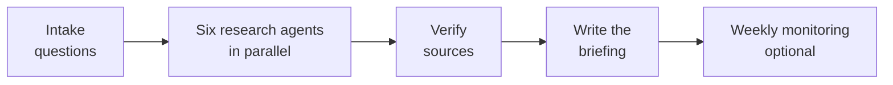

# client-intelligence

**One command turns the first week of research on a new client or industry into a sourced briefing.**

A Claude plugin marketplace with one plugin, `client-industry-intel`, built for consulting product managers. Six research agents work in parallel, their findings are verified against the sources, and the result is a briefing where every claim links to its evidence.

**[Framework Guide](https://docs.google.com/document/d/1cRi-vkNXB3iFRfVVwzrIeIPufj6hzb8nigOgNdQGAYo/edit?usp=sharing):** a Google Doc explaining every framework the skill uses.

## Quick start

In Claude Code:

```
/plugin marketplace add Nidhicollab/client-intelligence
/plugin install client-industry-intel@client-intelligence
```

Then ask, for example:

> Run a client intel brief on Duke Energy, focused on operations and supply chain.

## How it works



| Step | What happens |
|---|---|
| **1. Intake** | Asks for the company (public, private or subsidiary), scope, industry and geography, engagement focus, depth, and optional modules. |
| **2. Research** | Six specialist agents search the web at the same time, each with its own assignment. |
| **3. Verify** | Re-checks the sources behind the key numbers and flags conflicts and gaps. |
| **4. Synthesize** | Writes the briefing doc, section by section, with inline citations. |
| **5. Monitor** | Optional weekly task that adds a "What changed since last review" section. |

## The six research agents

| Agent | What it does | Framework it applies |
|---|---|---|
| **1. Company & Financials** | Maps the business model, segments, latest results and strategy, then benchmarks the client on its industry's KPIs. | Industry KPI library (see below) |
| **2. Investor & Market** | Tracks the stock against its sector, valuation against peers, analyst ratings and earnings-call themes. | Bull and bear cases, kept apart from sentiment |
| **3. Industry & Funding** | Traces how the industry evolved, current innovations, market size, and where VC and PE money is flowing. | Industry evolution, VC funding radar |
| **4. Customers & Segments** | Maps customer buckets and each one's need, revenue share, growth, roles and switching costs. | Customer segmentation; buyer vs. user vs. influencer |
| **5. Competitors** | Classifies competitors with evidence: what each does differently, recent moves, traction and threat to the client. | Incumbent / Adjacent / Insurgent |
| **6. SPEED-C & Regulation** | Scans the forces acting on the company and rates each as tailwind or headwind, with timing and impact. | SPEED-C |

Agent 2 and the funding radar in agent 3 are optional modules. Agent 2 runs for public companies only.

## Frameworks inside the plugin

For the detail behind each framework, read the [Framework Guide](https://docs.google.com/document/d/1cRi-vkNXB3iFRfVVwzrIeIPufj6hzb8nigOgNdQGAYo/edit?usp=sharing) (Google Doc).

### Competitor classification

| Type | Definition |
|---|---|
| **Incumbent** | A direct peer with the same business model. |
| **Adjacent** | A company from a neighboring industry that can reach the same customer need. |
| **Insurgent** | A startup or new business model attacking the value chain. |

The agent aims for 3 to 5 competitors of each type.

### SPEED-C

| Letter | Driver |
|---|---|
| **S** | Societal |
| **P** | Political (including pending legislation and regulator rulings) |
| **E** | Economic |
| **E** | Environmental |
| **D** | Demographic |
| **C** | Competitive |

Each driver gets 2 to 4 specific current forces, with direction, time horizon and likely effect.

### Industry KPI library

The Company & Financials agent picks the 6 to 10 KPIs the industry is judged on, reports the client's latest value for each, and adds a benchmark or peer median where one exists.

| Industry | Example KPIs |
|---|---|
| **Utilities** | Rate base growth, allowed ROE, O&M per customer, SAIDI/SAIFI, load growth, customer satisfaction |
| **SaaS** | ARR, net revenue retention (NRR), CAC payback, gross margin |
| **Banking and auto finance** | Net interest margin (NIM), charge-offs, penetration rate |
| **Retail** | Same-store sales, inventory turns |
| **Any industry** | NPS, where disclosed |

## After the agents finish

**Verify**

- Re-fetches the sources behind the 10 most important records, starting with numbers used in the executive summary.
- Shows conflicting figures side by side instead of averaging them.
- Downgrades stale or single-source claims.
- Turns coverage gaps into questions for the client.

**Synthesize**

- Each section opens with a two- or three-sentence "so what", then the evidence.
- Tables for KPIs, competitors, customer segments and SPEED-C drivers; live charts where they help.
- Estimates and inferences are marked as such.

## What the briefing contains

| # | Section |
|---|---|
| 1 | Executive summary: 5 key findings and 3 implications for the engagement |
| 2 | Company snapshot |
| 3 | Financials and KPIs |
| 4 | Investor and market view *(optional)* |
| 5 | Industry landscape |
| 6 | Funding and investment radar *(optional)* |
| 7 | Customers and segments |
| 8 | Competitive landscape |
| 9 | SPEED-C drivers |
| 10 | Implications for the PM: testable hypotheses, 5 to 8 interview questions, and "what would change our view" |
| 11 | Sources and data gaps |

## Evidence standard

Every finding is one record with the same fields:

| Field | Meaning |
|---|---|
| **Claim** | A concise, checkable finding |
| **Metric** | Value, unit, reporting period and reporting entity |
| **Source** | Title, direct URL and date |
| **Evidence type** | Filing, earnings, regulator, company, research, news or sentiment |
| **Confidence** | High, medium or low |
| **Interpretation** | Why it matters for this engagement |
| **Open question** | What still needs validation |

- Sources from the last 12 months are preferred; older ones are marked.
- Filings and regulators rank highest. Blogs and forums count only as sentiment.
- Reported facts, third-party estimates and interpretation are kept separate.
- Missing data is labeled "not publicly available", with the closest proxy named. It is never guessed.

## Transformation frameworks to apply next

The plugin does not run these. They are the frameworks a PM applies to the briefing afterward to turn the research into a point of view.

| Framework | What it shows |
|---|---|
| **Waves of Change** | Whether this is infrastructure, operating-model or business-model change |
| **Capability map** | Readiness across 12 capabilities, and the top gaps |
| **Transformation touchstones** | A five-dimension maturity check |
| **Kotter's Accelerate** | A change-leadership plan |
| **Business Portfolio Map** | Core versus edge bets |
| **Lean Startup** | Hypotheses turned into experiments |

Which to start with depends on the engagement focus:

| Engagement focus | Start with |
|---|---|
| Digital transformation | Waves of Change, capability map, transformation touchstones |
| New product | Lean Startup, Business Portfolio Map |

## Repository layout

```
.claude-plugin/marketplace.json
plugins/client-industry-intel/
  .claude-plugin/plugin.json
  skills/client-industry-intel/SKILL.md
```

## Portability

`SKILL.md` is plain markdown with YAML frontmatter, so other tools can use the same skill folder:

- Claude Code and Cowork load it through this marketplace.
- Agent tools that read `SKILL.md`, such as Codex CLI and Cursor, can use the same folder with their own marketplace or config file.

## License

MIT
